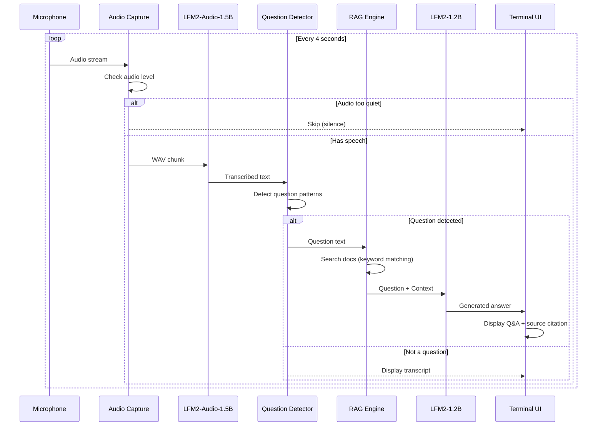

# Meeting Intelligence CLI

A real-time meeting assistant that listens to audio, transcribes speech, and answers questions using your documentation. Everything runs locally on your Mac using [LFM2-Audio](https://huggingface.co/LiquidAI/LFM2-Audio-1.5B-GGUF) for transcription and LFM2 for text generation.


-lightgrey)


## Quick Start

```bash
# Clone and setup
git clone <repo-url>
cd meeting-intelligence-cli
python3 -m venv venv
source venv/bin/activate
pip install -r requirements.txt

# Download models (see Models section below)

# Run with your microphone
python coach.py --mic
```

Speak a question like *"How does Liquid AI handle edge deployment?"* and watch it generate an answer from your docs.

## Architecture

The system uses two LFM models running locally via llama.cpp:



### Components

| Component | Model/Tool | What it does |
|-----------|------------|--------------|
| **Audio Capture** | sounddevice | Streams 4-second chunks from mic or BlackHole |
| **Transcription** | LFM2-Audio-1.5B | Speech-to-text via llama.cpp subprocess (~300ms) |
| **Question Detection** | Regex patterns | Identifies questions by structure and keywords |
| **RAG Search** | Keyword matching | Finds relevant doc chunks (no embeddings needed) |
| **Answer Generation** | LFM2-1.2B | Generates answer from question + context (~500ms) |
| **Vibe Check** | Keyword scoring | Detects emotional tone (Excited/Frustrated/etc.) |

### Why Two Models?

- **LFM2-Audio-1.5B** is a multimodal model that directly processes audio waveforms. It runs as a subprocess via the `llama-lfm2-audio` binary.

- **LFM2-1.2B** is a text model for generation. It runs via `llama-cpp-python` and takes the transcribed question + RAG context to produce answers.

This separation keeps each model focused on what it does best.

## Usage

### Microphone Mode (easiest way to test)

```bash
python coach.py --mic
```

Uses your Mac's built-in microphone. Just speak a question and the CLI will:
1. Transcribe your speech
2. Search your docs for relevant context
3. Generate and display an answer with source citation

### Test with Audio File

```bash
python coach.py --test audio.wav
```

Or generate test audio with macOS text-to-speech:

```bash
say -o test.aiff "What makes Liquid AI different from other AI models?"
afconvert test.aiff -o test.wav -d LEI16@16000 -f WAVE
python coach.py --test test.wav
```

### Live Meeting Mode (Zoom/Meet/Teams)

```bash
python coach.py
```

Captures from BlackHole virtual audio device. Requires setup (see below).

### List Audio Devices

```bash
python coach.py --list-devices
```

## Models

Download these to `models/`:

| Model | Size | Purpose |
|-------|------|---------|
| [LFM2-Audio-1.5B-Q8_0.gguf](https://huggingface.co/LiquidAI/LFM2-Audio-1.5B-GGUF) | 1.2 GB | Speech-to-text |
| mmproj-audioencoder-LFM2-Audio-1.5B-Q8_0.gguf | 317 MB | Audio encoder |
| audiodecoder-LFM2-Audio-1.5B-Q8_0.gguf | 358 MB | Audio decoder |
| [LFM2-1.2B-Q4_K_M.gguf](https://huggingface.co/LiquidAI/LFM2-1.2B-Instruct-GGUF) | 730 MB | Q&A generation |

Also download the llama.cpp runner from [LFM2-Audio runners](https://huggingface.co/LiquidAI/LFM2-Audio-1.5B-GGUF/tree/main/runners) → `runners/macos-arm64/`

## Live Meeting Setup (BlackHole)

To capture audio from video calls:

1. Install BlackHole: `brew install blackhole-2ch`

2. Create Multi-Output Device:
   - Open Audio MIDI Setup (Applications > Utilities)
   - Click + > Create Multi-Output Device
   - Check both BlackHole 2ch and your speakers

3. Set your meeting app's speaker to "Multi-Output Device"

4. Run: `python coach.py`

## Adding Your Own Docs

Drop PDF or Markdown files in `docs/`. The CLI loads all documents at startup.

```bash
cp your-product-docs.pdf docs/
python coach.py --mic
```

## Example Output

```
━━━━━━━━━━━━━━━━━━━━━━━━━━━━━━━━━━━━━━━━━━━━━━━━━━━━━━━━━━━━━━━━━━━━━━
  MEETING INTELLIGENCE AGENT
━━━━━━━━━━━━━━━━━━━━━━━━━━━━━━━━━━━━━━━━━━━━━━━━━━━━━━━━━━━━━━━━━━━━━━

? QUESTION:
   How does Liquid AI handle edge deployment?

ANSWER:
   Liquid AI models are optimized for edge devices with 2x faster
   inference and 90% less memory usage compared to traditional
   transformer architectures.

Source: LiquidAI_Technical_Whitepaper.pdf
Confidence: [########............] 40%
Vibe: Engaged

━━━━━━━━━━━━━━━━━━━━━━━━━━━━━━━━━━━━━━━━━━━━━━━━━━━━━━━━━━━━━━━━━━━━━━
Listening for next question... (Ctrl+C to stop)
```

## Project Structure

```
meeting-intelligence-cli/
├── coach.py              # Main entry point
├── lib/
│   ├── lfm2_wrapper.py   # LFM2-Audio subprocess wrapper
│   ├── audio_capture.py  # Streaming audio capture
│   ├── question_detector.py
│   ├── answer_generator.py
│   ├── rag_engine.py     # Document search
│   └── vibe_check.py     # Tone detection
├── models/               # GGUF model files
├── runners/              # llama.cpp binaries
├── docs/                 # Your documentation
└── output/               # Transcription logs
```

## Requirements

- macOS with Apple Silicon (M1/M2/M3/M4)
- 8GB+ RAM (16GB recommended)
- Python 3.10+

## Troubleshooting

**No audio detected**: Check that your mic is working (`--list-devices`) or that BlackHole is configured correctly for meeting mode.

**Model not found**: Ensure all GGUF files are in `models/` and the runner binary is in `runners/macos-arm64/`.

**High memory usage**: The CLI uses ~4GB RAM with both models loaded.

## License

MIT
